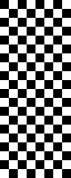
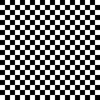
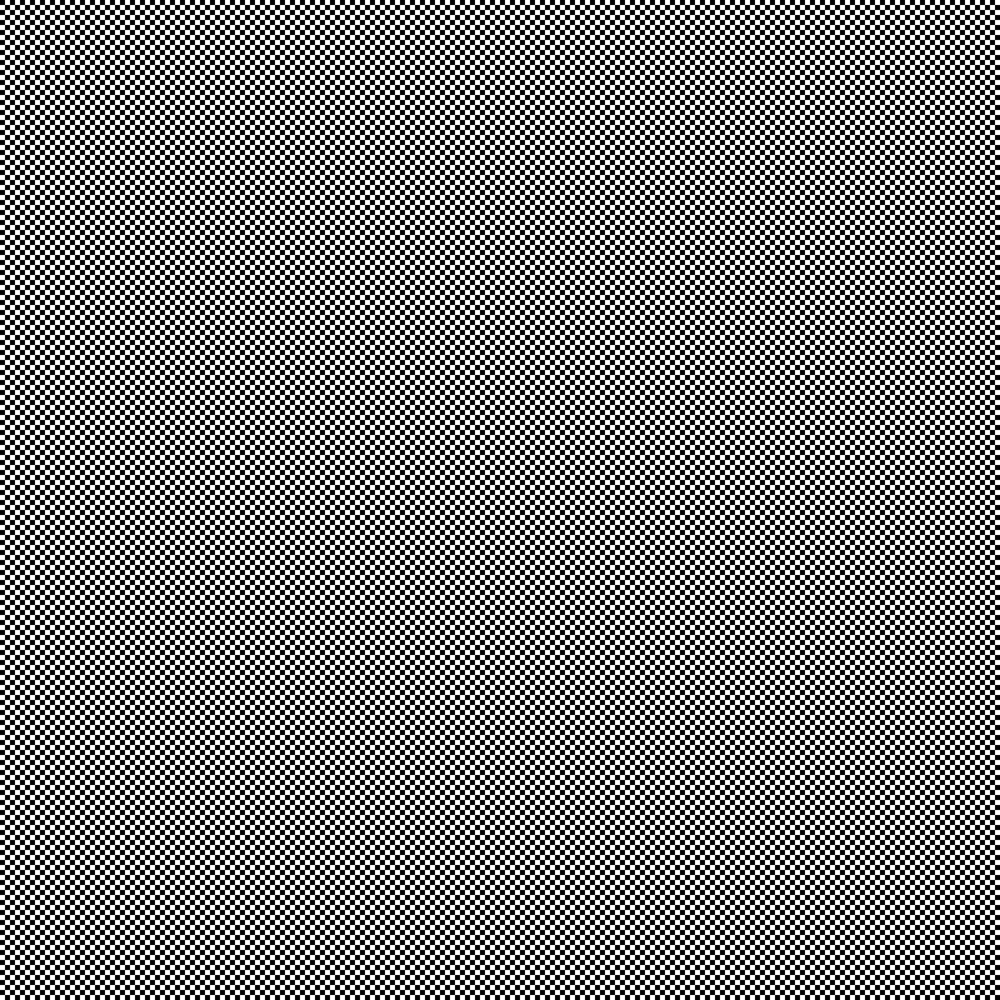
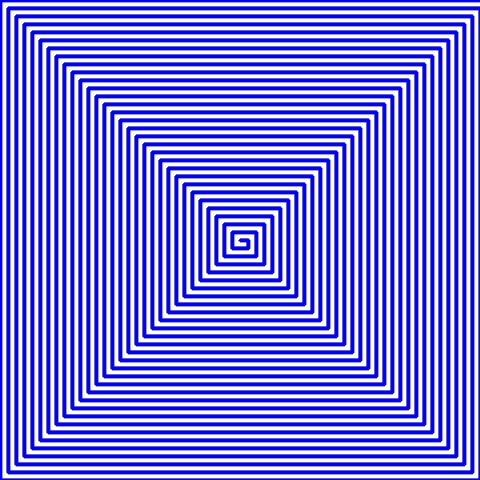
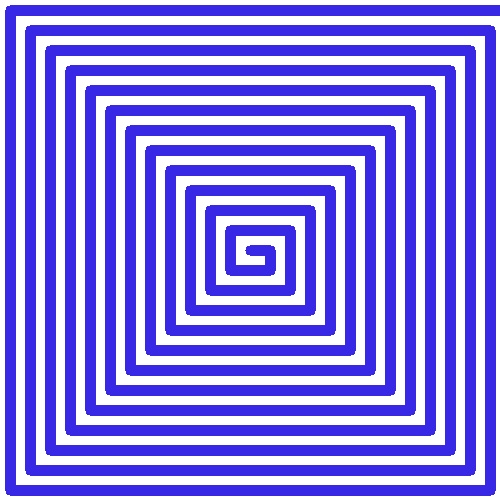

Сборка:

```shell
mkdir build && cd build && cmake .. && make
```
# Задание 1
### Пример 1 :
```shell
./program --rows 8 --cols 20 --cell 10
```


### Пример 2 :
```shell
./program --rows 20 --cols 20 --cell 10
```


### Пример 3 :
```shell
./program --rows 200 --cols 200 --cell 10
```



# Задание 2
### Пример 1 :
```shell
./program --width 600 --height 600 --thick 3 --step 10 --color 255,0,0
```


### Пример 2 :
```shell
./program --width 500 --height 500 --thick 10 --step 15 --color 23,40,10
```


### Пример 3 :
```shell
./program --width 500 --height 500 --thick 10 --step 20 --color 230,40,56
```

