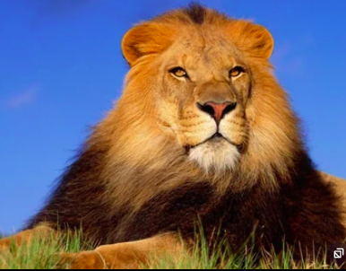
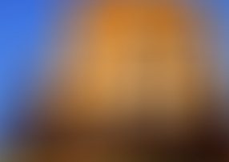

### Сборка:  

```shell
mkdir build && cd build && cmake .. && make
```

Оригинальное изображение:  


### Первый пример:  
```shell
./program --input "../meow.jpg" --out "../3x3.jpg"  ---kernel_size 3
```
Результат:  


### Второй пример:  
```shell
./program --input "../meow.jpg" --out "../5x5.jpg"  ---kernel_size 5
 ```

Результат:  


### Третий пример:
```shell
./program --input "../meow.jpg" --out "../100x100.jpg"  ---kernel_size 100
```
