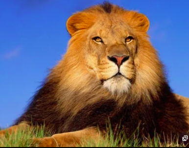
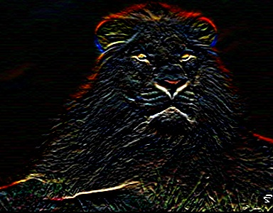

### Сборка:  

```shell
mkdir build && cd build && cmake .. && make
```

Оригинальное изображение:  


### Первый пример:  
```shell
./program --input "../meow.jpg" --out "../out_gaus.jpg" --kernel "../gaussian_blur.txt"
```
Результат:  


### Второй пример:  
```shell
 ./program --input "../meow.jpg" --out "../out_boke.jpg" --kernel "../boke.txt"
 ```

Результат:  


### Третий пример:
```shell
./program --input "../meow.jpg" --out "../out_beautiful.jpg" --kernel "../beautiful.txt"
```
